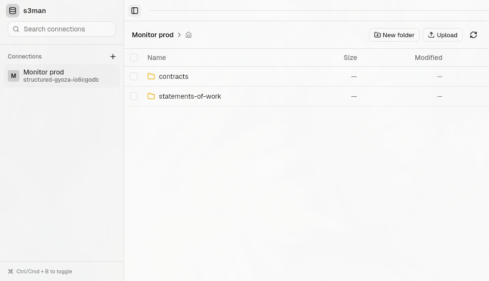

# s3man

> Cross-platform S3 desktop manager — browse, upload, and organize your S3 buckets from a native desktop app.

Built with [Tauri](https://tauri.app) + React + TypeScript.



## Features

- **Multiple connections** — save and switch between S3 connections by name
- **File browser** — navigate folders, view file sizes and modification dates
- **Upload files** — drag or select files to upload directly from the app
- **New folder** — create directories without leaving the UI
- **Refresh** — sync the current view with the latest bucket state
- **Native feel** — frameless window, keyboard shortcut (`Ctrl/Cmd+B`) to toggle the sidebar

## Installation

Download the latest release for your platform from the [Releases](../../releases) page:

| Platform | Format |
|---|---|
| Windows | `.msi`, `.exe` (NSIS) |
| macOS | `.app`, `.dmg` |
| Linux (Ubuntu/Debian) | `.deb` |
| Linux (Fedora/RHEL) | `.rpm` |
| Linux (Arch) | AUR (`s3man`) |

## Development

**Prerequisites**: [Node.js](https://nodejs.org) and the [Tauri prerequisites](https://tauri.app/start/prerequisites/) for your OS (Rust, system WebView).

```bash
npm install
npm run tauri dev
```

## Building

```bash
npm install
npm run dist
```

Output is written to `src-tauri/target/release/bundle`.

### Platform-specific builds

```bash
npm run dist:linux      # .deb + .rpm
npm run dist:linux:all  # .deb + .rpm + .AppImage
npm run dist:mac        # .app + .dmg
npm run dist:windows    # .msi + .exe (NSIS)
```

### AUR package

Generate a `PKGBUILD` and install hook from the built Debian artifacts:

```bash
RELEASE_BASE_URL="https://github.com/sarrietav-dev/s3man/releases/download/v0.1.0" npm run dist:aur
```

This produces `dist/aur/PKGBUILD` and `dist/aur/s3man.install`. After generating, run `makepkg --printsrcinfo > .SRCINFO` in your AUR repo and push.

## Releases

Automated release workflow: `.github/workflows/release.yml`

**Trigger**: push a version tag.

```bash
git tag v0.1.0
git push origin v0.1.0
```

The workflow builds and uploads all platform artifacts (`.deb`, `.rpm`, `.msi`, `.exe`, `.app`, `.dmg`) and attaches the AUR `PKGBUILD` to the GitHub Release.

### Signing

For signed release builds, configure the following repository secrets:

<details>
<summary>macOS</summary>

`APPLE_CERTIFICATE`, `APPLE_CERTIFICATE_PASSWORD`, `APPLE_SIGNING_IDENTITY`, `APPLE_ID`, `APPLE_PASSWORD`, `APPLE_TEAM_ID`, `APPLE_API_ISSUER`, `APPLE_API_KEY`, `APPLE_API_KEY_PATH`
</details>

<details>
<summary>Windows</summary>

`WINDOWS_CERTIFICATE`, `WINDOWS_CERTIFICATE_PASSWORD`
</details>

<details>
<summary>Linux (RPM)</summary>

`TAURI_SIGNING_RPM_KEY`, `TAURI_SIGNING_RPM_KEY_PASSPHRASE`
</details>
